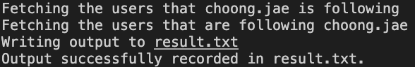

# Instacheck

## Curious to see who isn't following you back on Instagram?

Instacheck is a simple Python script that automatically compares the followees and followers of an Instagram account to find the users who aren't following the account back. You can use it to check your own account, or you can use to check on anyone who you're following.

## Usage

1. Clone this repo onto your computer
2. Follow the installation instructions for [Instaloader](https://instaloader.github.io/installation.html). You will need Python 3.6+ and pip
3. Enter the repo's root directory and run `python instacheck.py` in the command line
4. Log in to your Instagram account by following the prompts
5. When prompted to _Enter the username of yourself or someone you're following whose followers you want to compare_, you can either put in your own account's username again OR the username of an account you're following. **Note that you must spell the username exactly, and you MUST be following the target account**
6. The script will run. Depending on the number of followers, it may take a couple of minutes (For reference, I found that fetching around 1000 followers and 1000 followees took about 1 minute each way)
7. The list of non-followers will be written to `result.txt`

## Implementation

The script uses the open-source [Instaloader module](https://instalodaer.github.io) to scrape the followees and followers of a target Instagram account, and a simple set difference operation to find the non-followers.

Logging into your Instagram account is handled by Instaloader's built-in authentication, whose repo you can check out here [here](https://github.com/instaloader/instaloader). The `instacheck.py` script here is under 50 lines, so you can easily assure yourself that it is safe. Nonetheless, always be careful when handling private information.
